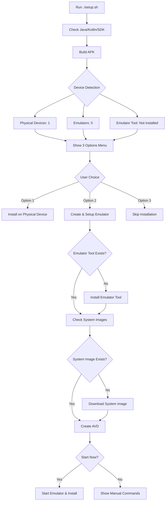

# Setup Script Features

## 🚀 Enhanced Setup Script (`setup.sh`)

### Three Installation Options

The setup script now provides **3 options** for app installation:

```
Where do you want to install the app?

  1) Physical Device
  2) Android Emulator (Create new)
  3) Skip installation
```

---

## 📱 Option 1: Physical Device

### Features:
- ✅ Auto-detects connected physical devices via ADB
- ✅ Lists all connected devices with serial numbers
- ✅ Multi-device support (select which device if multiple connected)
- ✅ Automatic APK installation
- ✅ Auto-launch app after installation (optional)

### Requirements:
- USB Debugging enabled on phone
- USB connection or wireless ADB
- "Install via USB" enabled (for Xiaomi/Redmi devices)

### Usage:
```bash
./setup.sh
# Select option 1 when prompted
```

---

## 🖥️ Option 2: Android Emulator (Create New)

### Features:
- ✅ **Automatic emulator tool installation** if missing
- ✅ **Automatic system image download** (Android 34)
- ✅ Interactive emulator creation with custom name
- ✅ Auto-start emulator after creation (optional)
- ✅ Wait for emulator boot completion
- ✅ Automatic APK installation on emulator
- ✅ Auto-launch app on emulator

### What It Installs:
1. **Emulator Tool** - If not present
   ```bash
   sdkmanager "emulator"
   ```

2. **Command Line Tools** - If avdmanager missing
   ```bash
   sdkmanager "cmdline-tools;latest"
   ```

3. **System Image** - Android 34 with Google APIs
   ```bash
   sdkmanager "system-images;android-34;google_apis;x86_64"
   ```
   - Size: ~600-800 MB
   - Download time: 5-10 minutes (depends on internet speed)

4. **AVD (Android Virtual Device)**
   ```bash
   avdmanager create avd -n "YourEmulatorName" \
       -k "system-images;android-34;google_apis;x86_64" \
       --device "pixel_5"
   ```

### Usage:
```bash
./setup.sh
# Select option 2 when prompted
# Enter emulator name (or press Enter for default: TestDevice)
# Wait for system image download (shows progress)
# Choose whether to start emulator now (Y/n)
```

### Manual Emulator Launch Later:
```bash
# List available emulators
emulator -list-avds

# Start specific emulator
emulator -avd TestDevice

# Install app
./gradlew installDebug
```

---

## ⏭️ Option 3: Skip Installation

### Features:
- ✅ Builds APK but skips device installation
- ✅ Shows APK location for manual installation
- ✅ Provides commands for later installation

### Usage:
```bash
./setup.sh
# Select option 3 when prompted
```

### Manual Installation Later:
```bash
# Via Gradle
./gradlew installDebug

# Via ADB (direct)
adb install -r app/build/outputs/apk/debug/app-debug.apk
```

---

## 🔍 Device Detection

The script intelligently detects:

1. **Physical Devices**
   ```bash
   adb devices | grep -w "device$"
   ```

2. **Emulator Tool Status**
   - Checks if `emulator` command exists
   - Checks `$ANDROID_HOME/emulator/emulator`
   - Shows warning if not installed

3. **Available Emulators**
   ```bash
   emulator -list-avds
   ```

### Display Example:
```
════════════════════════════════════
  Device Selection
════════════════════════════════════

Physical Devices Connected: 1
Emulators Available: 0
Emulator tool: Not installed  ← Shows if missing
```

---

## 🛠️ Error Handling

### If Emulator Tool Missing:
```
→ Emulator tool not found. Installing...
✓ Emulator tool installed
```

### If System Image Missing:
```
→ Downloading Android 34 system image...
⚠ This may take 5-10 minutes depending on your internet speed
Downloading...
Installing...
✓ System image downloaded
```

### If No Devices Found:
```
⚠ No devices or emulators found!

Options:
  1) Create a new Android Emulator
  2) Connect a physical device
  3) Skip installation (APK already built)
```

---

## 📊 Progress Indicators

The script provides clear feedback:

- `→` - Action in progress
- `✓` - Success
- `✗` - Error
- `⚠` - Warning

### Example Output:
```
→ Creating new Android Emulator...
→ Checking for system images...
✓ System image already installed
→ Starting emulator: TestDevice
⚠ This may take a few minutes...
→ Waiting for emulator to boot...
.........
✓ Emulator booted successfully!
→ Installing app on emulator...
✓ App installed on emulator!
✓ App launched on emulator!
```

---

## 🎯 Complete Setup Flow



---

## 💡 Tips

### Speed Up Emulator Creation:
1. Pre-install emulator tool:
   ```bash
   sdkmanager "emulator"
   ```

2. Pre-download system image:
   ```bash
   sdkmanager "system-images;android-34;google_apis;x86_64"
   ```

3. Create emulator manually:
   ```bash
   avdmanager create avd -n MyEmulator \
       -k "system-images;android-34;google_apis;x86_64" \
       --device "pixel_5"
   ```

### Check Emulator Status:
```bash
# List all emulators
emulator -list-avds

# Check running emulators
adb devices | grep emulator
```

### Troubleshooting:
```bash
# If stuck on "Checking for system images"
# Press Ctrl+C and try:
yes | sdkmanager "system-images;android-34;google_apis;x86_64"

# Check available system images:
sdkmanager --list | grep system-images

# Clear SDK cache if needed:
rm -rf ~/.android/cache
```

---

## 📦 What Gets Downloaded?

| Component | Size | Time (50 Mbps) |
|-----------|------|----------------|
| Emulator Tool | ~100 MB | 15-20 seconds |
| System Image (Android 34) | ~600-800 MB | 2-3 minutes |
| AVD Creation | ~50 MB | 5-10 seconds |
| **Total** | **~750-950 MB** | **~3-4 minutes** |

*Times are approximate and depend on internet speed*

---

## 🎉 Success Messages

### Physical Device:
```
════════════════════════════════
     🎉 SETUP COMPLETE! 🎉
════════════════════════════════

Launch 'MyApplication' from your phone!
Launch app now? (Y/n): y
Starting: Intent { cmp=com.example.myapplication/.SplashActivity }
✓ App launched!
```

### Emulator:
```
════════════════════════════════
     🎉 SETUP COMPLETE! 🎉
════════════════════════════════

✓ App launched on emulator!
```

---

## 🔗 Quick Reference

```bash
# Run full setup
./setup.sh

# Just build
./gradlew assembleDebug

# Install on connected device
./gradlew installDebug

# Start emulator manually
emulator -avd TestDevice

# View logs
cat build.log
adb logcat | grep MyApplication
```

---

Created by: **Satyam Tiwari** (@satyam16-ai)  
Email: satyamtiwariworks@gmail.com  
Repository: https://github.com/satyam16-ai/android-kotlin-template
